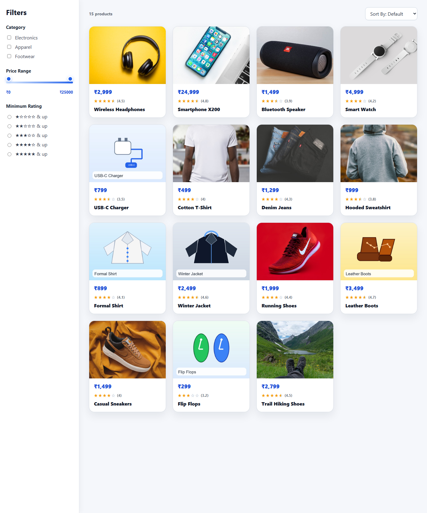
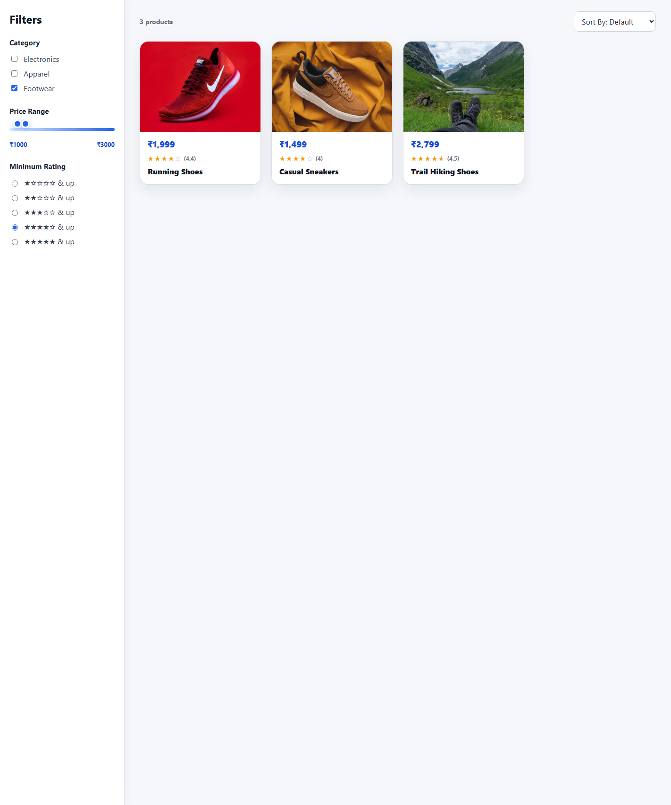
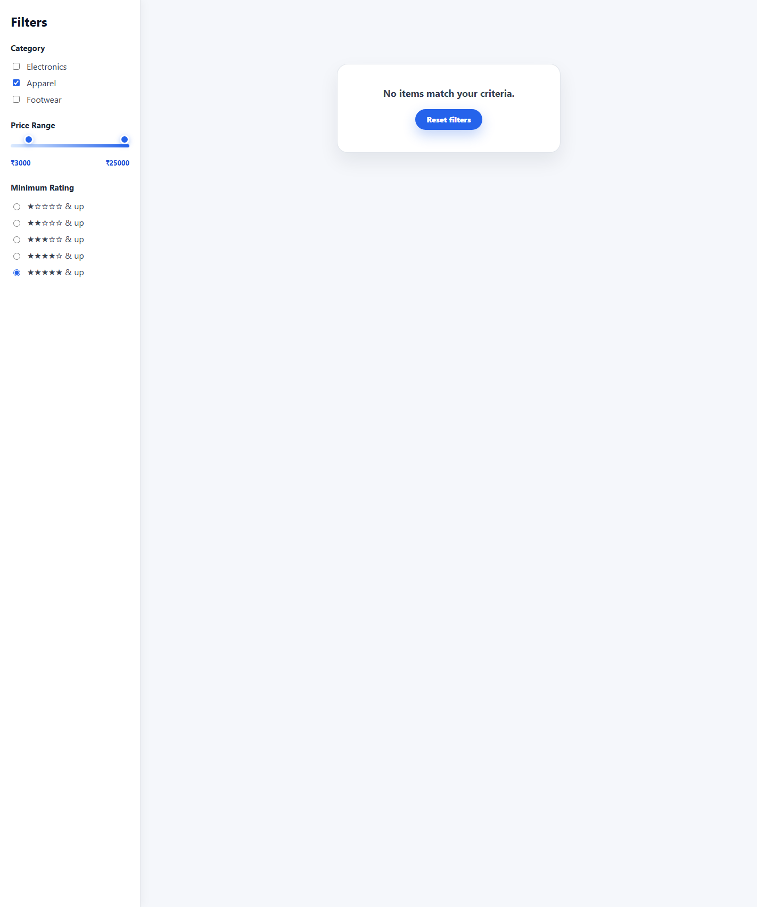
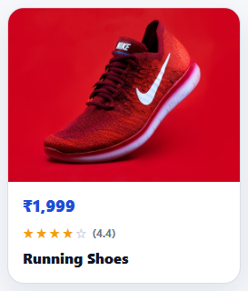

# Quantiphi E-Commerce Product Filter

Quantiphi E-Commerce Product Filter is a full-stack marketplace browsing interface for filtering a product inventory by category, price range, and minimum star rating. The UI updates immediately as users change controls, and the backend returns the filtered and sorted product list without requiring a manual submit action.

The project was built for the Quantiphi Vibe Coding assessment brief: an Express backend owns the business logic, while the React + Vite frontend focuses on presentation and user interaction.

## Tech Stack

- **Backend: Node.js + Express**: owns all filtering, sorting, validation, and product-selection logic, as required by the assessment brief.
- **Frontend: React + Vite**: renders the sidebar, product grid, controls, loading/error/empty states, and sends criteria to the API. It does not duplicate product filtering or sorting logic.
- **Data source: local product inventory module**: `backend/data/products.js` provides the master product array used by the server.

## Features Mapped to the Brief

- **Category checklist**: sticky sidebar checkboxes for `Electronics`, `Apparel`, and `Footwear`.
- **Dual-point price slider**: two range inputs allow users to select minimum and maximum price bounds.
- **Minimum star rating radios**: radio buttons select a minimum rating from 1 to 5 stars.
- **Product grid cards**: each card displays an image thumbnail, price, star rating, and product name.
- **Sort By dropdown**: top-right grid control supports default order, `Price: Low to High`, and `Top Rated First`.
- **Instant no-submit updates**: every filter/sort change triggers a debounced backend request; there is no Submit button.
- **Empty state + Reset filters**: zero-result criteria show `No items match your criteria.` and a `Reset filters` button.
- **Server-side logic**: category, price, rating, sort, and validation are handled by Express before results are returned to React.

## Folder Structure

```text
.
|-- backend/
|   |-- data/
|   |   `-- products.js
|   |-- logic/
|   |   |-- filterProducts.js
|   |   `-- sortProducts.js
|   |-- routes/
|   |   `-- products.js
|   |-- package.json
|   |-- server.js
|   `-- test.js
|-- frontend/
|   |-- src/
|   |   |-- api.js
|   |   |-- App.jsx
|   |   |-- App.css
|   |   `-- components/
|   |       |-- EmptyState.jsx
|   |       |-- PriceSlider.jsx
|   |       |-- ProductCard.jsx
|   |       |-- ProductGrid.jsx
|   |       |-- RatingFilter.jsx
|   |       |-- Sidebar.jsx
|   |       `-- SortDropdown.jsx
|   |-- package.json
|   `-- vite.config.js
|-- docs/
|   `-- screenshots/
|-- AUDIT_REPORT.md
|-- BUILD_LOG.md
|-- LICENSE
`-- README.md
```

## Setup and Run

No custom environment variables are required.

Install backend dependencies:

```bash
cd backend
npm install
```

Install frontend dependencies:

```bash
cd frontend
npm install
```

Start the backend API on port `5000`:

```bash
cd backend
npm start
```

Start the frontend dev server on port `5173`:

```bash
cd frontend
npm run dev
```

Open the app:

```text
http://localhost:5173
```

The Vite dev server proxies `/api` requests to `http://localhost:5000`.

## API Contract

### `GET /api/products`

Returns the filtered and sorted product list.

Supported query parameters:

| Parameter | Type | Description |
| --- | --- | --- |
| `categories` | comma-separated string | Optional category list, for example `Electronics` or `Electronics,Footwear`. |
| `minPrice` | number | Optional minimum price. |
| `maxPrice` | number | Optional maximum price. |
| `minRating` | number | Optional minimum rating from `1` to `5`. |
| `sortBy` | string | Optional sort mode: `priceLowHigh` or `topRated`. |

### `POST /api/products`

The frontend uses `POST /api/products` with a JSON body:

```json
{
  "categories": ["Footwear"],
  "minPrice": 1000,
  "maxPrice": 3000,
  "minRating": 4,
  "sortBy": ""
}
```

Example request:

```bash
curl -s "http://localhost:5000/api/products?categories=Footwear&minPrice=1000&maxPrice=3000&minRating=4"
```

Actual response:

```json
{
  "count": 3,
  "products": [
    {
      "id": 11,
      "name": "Running Shoes",
      "category": "Footwear",
      "price": 1999,
      "rating": 4.4,
      "image": "https://placehold.co/200x200?text=Runners"
    },
    {
      "id": 13,
      "name": "Casual Sneakers",
      "category": "Footwear",
      "price": 1499,
      "rating": 4,
      "image": "https://placehold.co/200x200?text=Sneakers"
    },
    {
      "id": 15,
      "name": "Trail Hiking Shoes",
      "category": "Footwear",
      "price": 2799,
      "rating": 4.5,
      "image": "https://placehold.co/200x200?text=Hiking"
    }
  ]
}
```

Invalid input returns `400`, for example `minRating=9`.

## Testing

Run backend assertions:

```bash
cd backend
node test.js
```

Expected output:

```text
All filter tests passed. Empty criteria returns 15 of 15 items.
```

Manual endpoint checks:

```bash
curl -s "http://localhost:5000/api/products"
curl -s "http://localhost:5000/api/products?categories=Electronics"
curl -s "http://localhost:5000/api/products?minPrice=1000&maxPrice=3000"
curl -s "http://localhost:5000/api/products?minRating=4.5"
curl -s "http://localhost:5000/api/products?categories=Footwear&minPrice=1000&maxPrice=3000&minRating=4"
curl -s "http://localhost:5000/api/products?sortBy=priceLowHigh"
curl -s "http://localhost:5000/api/products?sortBy=topRated"
curl -s "http://localhost:5000/api/products?minRating=9"
curl -s "http://localhost:5000/api/products?categories=Apparel&minPrice=99999&maxPrice=100000&minRating=5"
```

## Screenshots

Default product grid with real product images:



Filtered results with sidebar controls active and both price handles moved:



Zero-match empty state with reset action:



Product card close-up:



## Assessment Compliance

The final audit verdict is recorded in [AUDIT_REPORT.md](AUDIT_REPORT.md) with a 100% PDF-compliance confidence score after the final repo-cleanliness pass.
